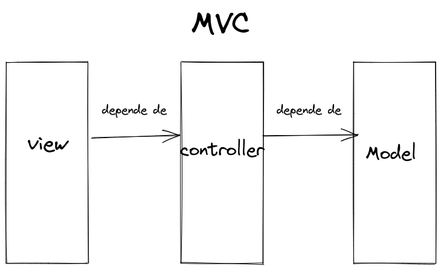
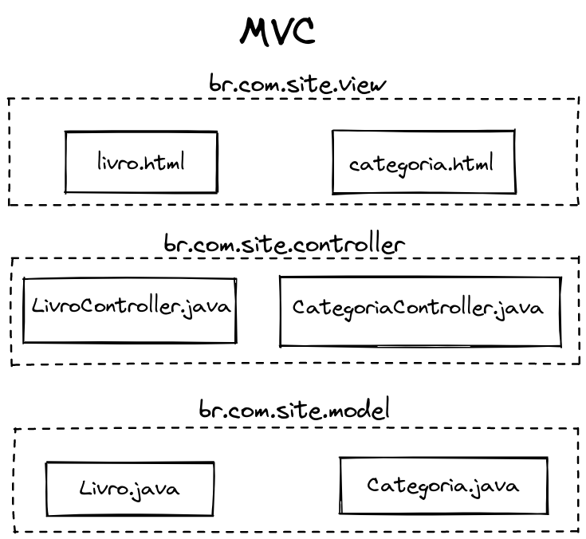
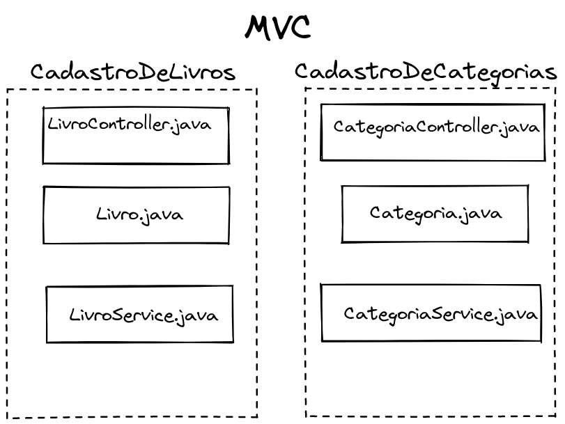
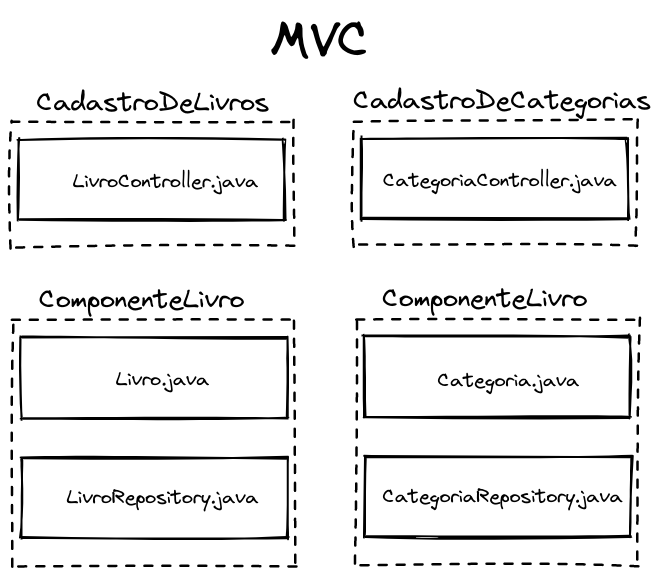
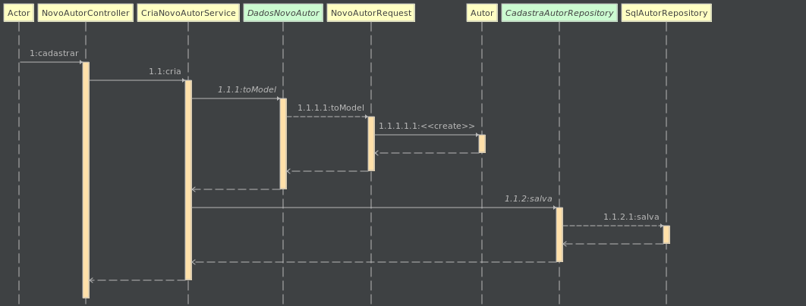
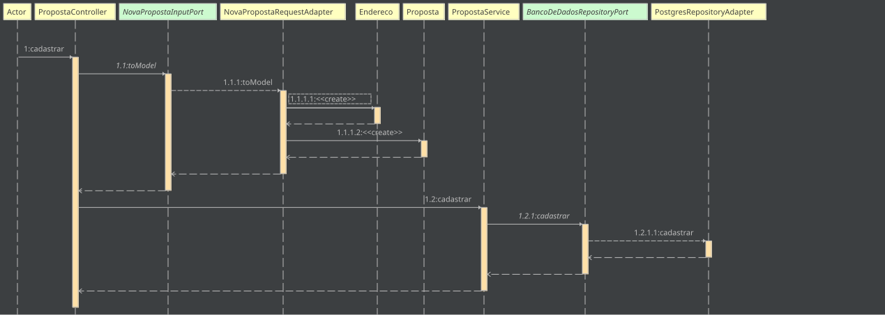
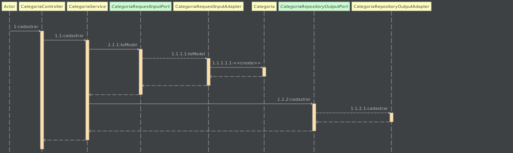
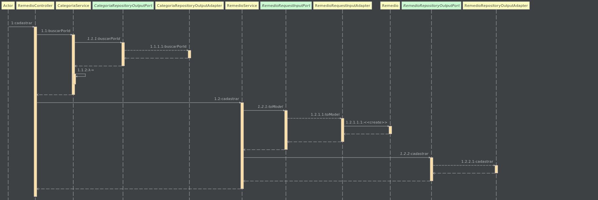
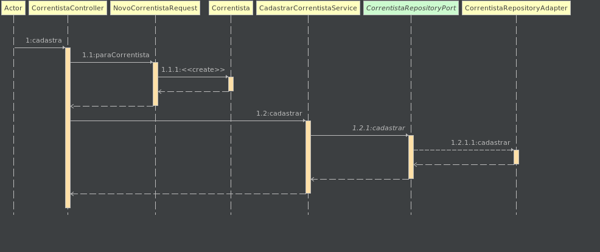
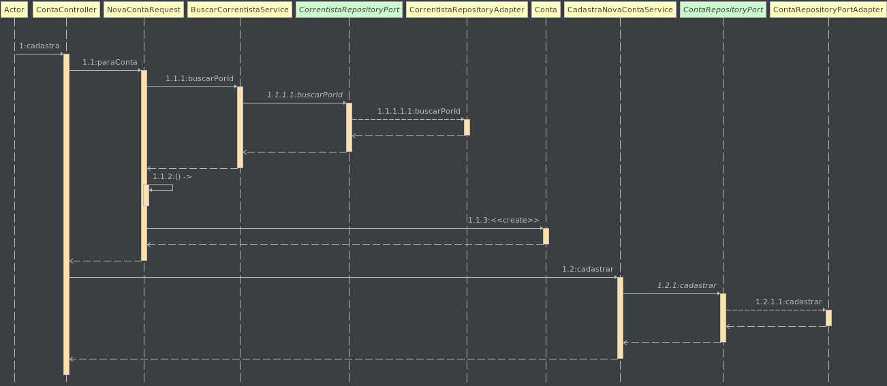

# zupedu-introducao-arquitetura-hexagonal
Treinamento da Zup Edu sobre a Introdução a Arquitetura Hexagonal

## 1. Começando com a Arquitetura Hexagonal
### 1.1 Aprenda a criar um cadastro utilizando a Arquitetura Hexagonal
- Vídeo: [S01] Implementando um cadastro de autores com Arquitetura Hexagonal - Conteúdo Técnico

### Teorias
**1. MVC e Arquitetura em Camadas**

- Vídeo: [S01] MVC e Arquitetura em Camadas - Conteúdo Técnico

Tópicos:

    00:10 - introdução com a visão geral do conteúdo    
    00:45 - arquitetura de código    
    06:00 - revisão dos objetivos da arquitetura de código    
    07:01 - arquitetura MVC    
    11:40 - modelando o MVC no Excalidraw    
    12:50 - organizando os arquivos em camadas no MVC    
    15:35 - outros tipos de design de código, Simon Brown (C4 Model)     
    16:30 - organizando os arquivos utilizando package by layer    
    17:40 - organizando os arquivos utilizando package by feature    
    21:20 - organizando os arquivos utilizando package by component    
    23:10 - visão geral da arquitetura

Objetivos de um padrão de arquitetura:
  1. ter um modelo mental de como padronizar o projeto. Trazer o modelo mental para um modelo digital da computação
  2. facilitar as mudanças de negócios
  3. previnir que mudanças de `"infraestrutura"` (banco de dados, frameworks, meios de comunicação como http e GRPC, libs e etc) afetem/minimizem as mudanças no negócio; evitar mudanças de agentes externos comprometam ao negócio

Ao se falar de arquitetura de software é interessante ter em mente a diferença entre arquitetura e a organização de arquivos de um projeto. Por exemplo, no MVC temos 3 componentes: view, controller e model, sem criar uma relação de pacotes e pastas, mas pensando nas camadas de forma abastrata é possível identificar uma dependência/hierarquia entre os três componetes, onde a `view` depende do `controller` e o `controller` depende do `model`, seguindo uma ordem hierarquica que garante que a `view` não tenha um acesso direto ao `model` e vice-versa . Se liga no fluxo abaixo:



Ainda pensando na arquitetura MVC é possível organizar os componentes `model`, `view` e `controller` usando pacotes e pastas como o `Package by layer`, `Package by feature` e `Package by component` utilizando a mesma arquitetura, no caso, MVC.


Observe o `Package by layer` com uma representação de fatias horizontais, conforme a imagem abaixo:




Agora o observe o `Package by feature` com uma representação de pasta/pacotes com fatias verticais:



Agora um exemplo do `Package by component`:



  - Links:    
    - [MVC XEROX PARC 1978-79](https://folk.universitetetioslo.no/trygver/themes/mvc/mvc-index.html)
    - [Package by component and architecturally-aligned testing](http://www.codingthearchitecture.com/2015/03/08/package_by_component_and_architecturally_aligned_testing.html)
    - [c4 Model - Simon Brown](https://c4model.com/)

**2. Introdução sobre Arquitetura Hexagonal**
- Video: Introdução sobre Arquitetura Hexagonal

Tópicos
```
02:50 Motivação 
07:03 Entendendo hexagonal vs portas e adaptadores
16:42 Desenho da arquitetura hexagonal
```

**Motivação:**

Os problemas das lógicas de negócios junto com os códigos de interface do usuário (camada de visualização)
- difícil de ser testada de forma isolada em aplicações que tem a lógica de negócio embutida na camada de visualização
- pela mesma razão é difícil trocar a interface com o usuário, por exemplo, mudando de uma interface web para uma api, smartphone, sistema batch ou até nos casos de troca de protocolos de comunicação como HTTP para GRPC
- pela mesma razão se torna difícil a troca de `"infraestrutura"` da aplicação como a troca de banco de dados, frameworks e bibliotecas

**Conceito de portas e adaptadores**

- as portas são as nossas interfaces, por exemplo, podemos ter uma porta de `notificação` e uma porta de `banco de dados`
- os adaptadores são as classes que implementam as nossas portas; podemos ter diversos adaptadores de uma mesma porta, por exemplo, podemos ter um adaptador para o `postgres`, outro para o `mysql` e outro para um `mock` e todos implementam a porta `banco de dados`

Podemos utilizar os diversos tipos de organização de pacotes na implementação da Arquitetura Hexagonal.

Links:
- [Hexagonal architecture](https://alistair.cockburn.us/hexagonal-architecture/)

**3. Criando um projeto Java seguindo a arquitetura hexagonal**
- Vídeo: Criando um Projeto Java seguindo a Arquitetura Hexagonal - Conteúdo Técnico

### Aprenda a criar um cadastro utilizando a Arquitetura Hexagonal
- Vídeo: Implementando um cadastro de autores com Arquitetura Hexagonal - Conteúdo Técnico
- [Link do código gerado no vídeo](https://github.com/zup-academy/livraria/tree/hexagonal-tc1-lt1/src/main/java/com/zupedu/livraria)

Diagrama de sequência do projeto livraria



**Questionário**

A arquitetura em camadas é uma forma de organização de arquivos em um projeto?

`R:` Sim,  Arquitetura em camadas é uma forma de organização de arquivos em um projeto de software.
Caso você queira continuar aprendendo mais sobre o assunto recomendamos a leitura do artigo: "[Layered Architecture" da Baeldung](https://www.baeldung.com/cs/layered-architecture)".

A arquitetura em camadas define um modelo de dependência entre as camadas. Assim, as camadas mais externas podem depender das camadas internas, mas a camada interna não pode depender da externa

`R:` Sim, caso você queira continuar aprendendo mais sobre o assunto, recomendamos o post "[The Pattern: Ports and Adapters ("Object Structural")](https://alistair.cockburn.us/hexagonal-architecture/)" do Alistair Cockburn

Na Arquitetura Hexagonal, podemos ter apenas 6 portas e 6 adaptadores

`R:` Não, Caso você queira continuar aprendendo mais sobre o assunto recomendamos. Além do post sobre Arquitetura Hexagonal do Cockburn, recomendamos olhar o conceito de DIP do SOLID.


**Recomendações:**

Caso você queira continuar aprendendo mais sobre o assunto recomendamos a leitura do artigo do Alistair Cockburn e revisitar o conceito de DIP do SOLID. Além disso, pensando em linguagens orientadas a objetos, estudar polimorfismo ajuda na compreensão desses tipos arquiteturais.

### Atividades obrigatórias

#### **Implemente o cadastro de interesse para a abertura de uma conta digital**

Implemente o cadastro da nova Proposta para abertura da conta seguindo as restrições a seguir:

Quando uma pessoa tem o interesse em abrir uma conta digital, ela envia uma proposta contendo algumas informações pessoais.
- Baixe ou clone este repositório com o [projeto do banco digital](https://github.com/zup-academy/bancodigital)
- Deve-se informar o nome completo;
- É necessário informar um CPF;
- É preciso infomar um email que esteja em um formato válido
- A pessoa deve que informar um endereço contendo o CEP, o logradouro, número e um complemento, caso exista.
- Para sua API REST:
  - Se o cadastro ocorrer com sucesso, deve-se retornar o status HTTP 201;
  - Se existe algum erro de validação, deve-se retornar o status HTTP 400;

- [Minha resposta](https://gist.github.com/adrianoavelinozup/d53345e1e262324674947847650682fe)
- [Resposta do especialista](https://gist.github.com/yurioliveirazup/30cf9af1417a320e43dab1330dc40123#file-novapropostacontroller-java)

É interessante que você revise os conteúdos vistos durante este programação de formação e caso você queira continuar aprendendo mais sobre o assunto recomendamos a leitura do artigo de arquitetura hexagonal do Cockburn e revisitar os conceitos de SOLID. Principalmente sobre o DIP (Princípio de Inversão de Dependência)

Caso você queira continuar aprendendo mais sobre o assunto recomendamos a revisão do artigo de arquitetura hexagonal do Cockburn e revisitar os conceitos de SOLID. Além disso, olhar os posts do Bob Martin sobre SOLID e sobre arquitetura limpa (Clean Architecture) principalmente na parte que é citado sobre a regra de dependência pode ampliar os seus horizontes.

Diagrama de sequência da abertura de uma conta digital desenvolvida na atividade:



#### **Implementando o cadastro de remédios para uma farmácia digital**
Nessa atividade, vamos construir o cadastro de remédios em uma sistema para uma farmácia. Para isso, siga os passos a seguir:
- Baixe ou clone este [repositório com o projeto da farmácia digital](https://github.com/zup-academy/farmacia-digital/);
- Siga o README do projeto;
- Implemente o cadastro de baseado nas informações a seguir.
- Todo remédio tem um nome obrigatório
- Todo remédio é fabricado por uma farmacêutica;
- Todo remédio pertence a uma categoria (antibiótico, antipirético, analgésicos, entre outros)
- Todo remédio deve conter uma data de fabricação
- Todo remédio precisa ter uma data de validade
- Para sua API REST:
  - Se o cadastro ocorrer com sucesso, deve-se retornar o status HTTP 201;
  - Se existe algum erro de validação, deve-se retornar o status HTTP 400;

A implementação da atividade está disponível em [./farmacia-digital](./farmacia-digital)

Cadastrar categoria de remédio:


Cadastrar remédio:


#### Respostas

**Controller**

Crio a classe controller anotada com `@RequestMapping` informando o path e `@RestController`. Adiciono o método cadastrar anotado com `@PostMapping` que recebe os dados da request anotado com `@Valid` e `@RequestBody` e um segundo parâmetro utilizando um `URIComponentBuilder`. No corpo do método, converto os dados de request numa classe de domínio, persisto no banco de dados utilizando um service que utiliza uma implementação de repository port, injetada via construtor, para armazenar as  informações no banco de dados. Retorno um `ReponseEntity` utilizando o método create, passando uma URI gerada utilizando o parâmetro do método, URIComponentBuilder, para gerar uma status 201 com o location.

**Service**

Crio um classe de service anotada com `@Service` e adiciono o método salvar que recebe uma classe de domínio como parâmetro. No corpo do método, utilizo um port de repository injetado via construtor para persistir no banco de dados.

**Adaptador de persistência da aplicação**

Crio uma classe anotada com @Component e que implementa a porta responsável pela persistência dos dados. Implemento os métodos necessários e utilizo um repository do Spring, injetado via construtor, para persistir os dados. 

## 2. Refatorando projetos para a Arquitetura Hexagonal

### Teorias necessárias
Refatorando projetos para a Arquitetura Hexagonal

- Passando um código de MVC para Arquitetura Hexagonal
  - Video: Passando um código de MVC para Arquitetura Hexagonal
### Atividades preparatórias

- Video: Passando um código MVC de um cinema para Arquitetura Hexagonal
  - [Respositório do projeto desenvolvido no vídeo](https://github.com/zup-academy/cineminha/tree/hexagonal-tc2-lt1)


Descreva como você passou o cadastro de filmes para Arquitetura Hexagonal:
- Crio a porta de saída para o banco dados (CadastraNovoFilmeRepository)
- Crio o repository para de Filme (FilmeRepository)
- Crio o adapter (SqlFilmeAdapter) que implementa a porta de saída para o banco de dados e que usa um repository de filme gerado no spring 
- Crio um caso de uso (service) para cadastro de filme (MaterFilme). Nele injeto um CadastraNovoFilmeRepository para realizar as transações com banco de dados
- Realizo as devidas alterações de dependências nas classes
- Crio os pacotes domain, adapters e application. Movo as devidas classes e interfaces para seus devidos pacotes

**[Resposta do Especialista]**

Começaria pelo controller e caminharia pelas dependências da classe para ter um panorama do que é preciso fazer. Começaria separando as classes em pacotes seguindo a estrutura adapter, domain, application. Manteria o controller no pacote application e moveria o modelo de Filme e o enum Classificacao para o pacote domain.

Depois disso, criaria um serviço, que estaria no pacote domain, na aplicação que seria responsável por chamar uma porta (interface) que seria responsável por salvar o filme no banco do dados e extrairia a chamada do repositório do controller para essa classe de serviço. A porta seria implementada por uma classe no pacote adapter que seria responsável por tratar a persistência e delegar as chamadas para o repository do spring.

Para a classe de entrada de dados, NovoFilmeRequest, seria criado uma interface com o método toModel() no pacote domain chamada DadosNovoFilme na qual a classe NovoFilmeRequst implementasse essa interface.

Descreva como você passou o cadastro de sessões para Arquitetura Hexagonal:
- Crio a porta de saída para o banco de dados (CadastraNovaSessaoRespository)
- Crio o adapter (SqlSessaoAdapter) que implementa a porta de saída do banco de dados e que usa o repository de sessao gerado no Spring
- Crio um caso de uso (service) responsável por cadastrar a Sessão (ManterSessao) e que injeta um CadastraNovaSessaoRespository para salvar no banco de dados
- Realizo as devidas alterações de dependências nas classes
- Crio os pacotes domain, adapters e application. Movo as devidas classes e interfaces para seus devidos pacotes

**[Resposta do Especialista]**

Começando pelo controller e caminharia pelas dependências da classe para ter um panorama do que é preciso fazer. Começaria separando as classes em pacotes seguindo a estrutura adapter, domain, application. Manteria o controller no pacote application e moveria o modelo de Filme para o pacote domain.

Como depois dessas mudanças o pacote model e repository estariam vazios, apagarias estes pacotes.

Feito isso, no domínio criaria um serviço que seria responsável por chamar a porta (interface) que seria responsável por definir o contrato que salva uma sessão no banco do dados e removeria a chamada do repositório de sessão do controller. A porta seria implementada por uma classe no pacote adapter que seria responsável por tratar a persistência e delegar as chamadas para o repository do spring.

Para a classe de entrada de dados, NovaSessaoRequest, poderíamos implementar de algumas formas. Seria criado uma interface no domínio chamada DadosNovaSessao com um método toModel() que converteria a request para o objeto Sessao. Já que uma nova sessão depende de alguma forma para buscar um filme e uma sala. A minha abordagem primária seria criar outras duas interfaces: BuscaFilme e a BuscaSessao. Essas interfaces são portas que seriam implementadas pelo adaptador de persistência do Filme e da Sala, respectivamente. Nesses adaptadores, delegaria a chamada para o repository do Spring.

Obs: É interessante que você revise os conteúdos vistos durante este programação de formação e caso você queira continuar aprendendo mais sobre o assunto recomendamos a leitura do artigo de arquitetura hexagonal do Cockburn e revisitar os conceitos de SOLID. Principalmente sobre o DIP (Princípio de Inversão de Dependência)

### Atividades obrigatórias
**Refatore o código de um projeto de gestão de correntistas em um Banco Digital**

- [Respositório do projeto do banco digital 2](https://github.com/zup-academy/bancodigital)

Aplicando os conhecimentos adquiridos e utilizados até aqui

1. Descreva como você criou estruturou os pacotes da aplicação

    Crio os pacotes adapters, domain e application. Em adapters adiciono as classes que implementam os ports e as interfaces de repository do Spring num pacote interno. Em domain adiciono as classes de negócio (domínio da aplicação) separadas por pacote com seus usecases e demais interfaces e classes envolvidas ao negócio. Em application adiciono as classes de controllers e as classes de DTO num pacote interno.

    [Resposta do Especialista]

    Trabalharia em camadas criando um pacote chamado application para manter os Controller e as classes de entrada. Um pacote chamado domain para manter as classes relativas ao domínio da aplicação (parte de dentro do hexágono) e, por fim, criaria um pacote chamado adapters no qual ficariam os adaptadores da aplicação

2. Descreva como você passaria o cadastro de uma nova pessoa que fosse correntista da conta

    Crio o pacote `application/correntista` e movo as classes de controller e DTOs (classes de entrada) no devidos pacotes. Na classe do controller altero a dependência da interface do repository do spring por uma classe de usecase chamada CadastraCorrentistaService (pacote domain) que utiliza uma port/interface (pacote domain), chamada CorrentistaRepositoryPort. A port/interface terá uma implementação chamada CorrentistaRepositoryAdapter (pacotes adapaters) que utiliza o repository do Spring responsável por persistir no banco de dados.

    [Resposta do Especialista]

    Dentro do pacote application, criaria uma pacote chamado correntistas e moveria as classes CorrentistaController e NovoCorrentistaRequest para lá. Além disso, na pasta domain criaria também um pacote chamado correntistas e moveria a entidade Correntista para lá. Dentro desse diretório criaria um serviço e uma interface chamada DadosNovoCorrentista na qual estaria definido um método chamado paraCorrentista(). Essa interface seria implementada pela classe de entrada (NovoCorrentistaRequest). No novo serviço, teria um método que receberia essa nova interface como parâmetro.

    Este método será o responsável por chamar a porta que é responsável por salvar um novo objeto Correntista no banco. Logo, criaria uma interface para representar essa porta com um método que recebesse a entidade Correntista e colocaria essa porta como dependência do novo serviço.

    Como foi criado uma porta, é necessário criar um adaptador. No pacote adapters, criaria um novo pacote chamado persistence e outro pacote, dentro de persistence, chamado correntista. No pacote correntista criaria uma classe chamada SqlCorrentistaAdapter e moveria o repositório já existente do Spring para esse pacote. Nesse adapter, delegaria a chamada para o repository do Spring.

    Para finalizar, no controller, ao invés de receber a interface, receberia o serviço que foi criado e apagaria a referência para o repository do Spring.

3. No cadastro de uma nova conta, é passado um CorrentistaRepository como parâmetro no método paraConta() da classe NovaContaRequest. Quando transformamos essa parte para seguir a Arquitetura Hexagonal, que mudanças precisam ser feitas?

    - crio o método buscarPorId na port CorrentistaRepositoryPort e implemento esse novo método no adapter CorrentistaRepositoryAdapter que utiliza o repository de correntista do spring (CorrentistaRepository) para consultar o correntista no banco de dados
    - crio o usecase/service BuscarCorrentistaService. Adiciono o método buscarPorId que utiliza uma port CorrentistaRepositoryPort para encontrar um correntista
    - no método paraConta() da classe NovaContaRequest altero o parâmetro de CorrentistaRepository para BuscarCorrentistaService
    - e para finalizar, no controller de conta altero a dependência do repository do spring para o service BuscarCorrentistaService
    
    [Resposta do Especialista]

    Ao invés de receber um repositório direto do Spring, uma alternativa é receber a Porta que fica responsável por buscar um Correntista de algum lugar (do banco de dados por exemplo) e trocar a implementação do método.

    Outra solução, seria usar algo como a interface Function da API do Java 8

- [Implementação de arquitetura hexagonal no projeto Banco Digital 2](https://github.com/my-study-area/zupedu-introducao-arquitetura-hexagonal/tree/main/bancodigital2)

Diagrama de sequência do cadastro de correntista:


Diagrama de sequência do cadastro de conta:


## Links
- [MVC XEROX PARC 1978-79](https://folk.universitetetioslo.no/trygver/themes/mvc/mvc-index.html)
- [Package by component and architecturally-aligned testing](http://www.codingthearchitecture.com/2015/03/08/package_by_component_and_architecturally_aligned_testing.html)
- [c4 Model - Simon Brown](https://c4model.com/)
- [Excalidraw](https://excalidraw.com/)
- [Hexagonal architecture](https://alistair.cockburn.us/hexagonal-architecture/)
- [Link do código gerado no vídeo Implementando um cadastro de autores com Arquitetura Hexagonal - Conteúdo Técnico](https://github.com/zup-academy/livraria/tree/hexagonal-tc1-lt1/src/main/java/com/zupedu/livraria)
- [Layered Architecture" da Baeldung](https://www.baeldung.com/cs/layered-architecture)
- [Package by Feature](https://phauer.com/2020/package-by-feature/)
- [Ports and Adapters Pattern (Hexagonal Architecture) by Juan Manuel Garrido de Paz](https://jmgarridopaz.github.io/content/hexagonalarchitecture.html)
